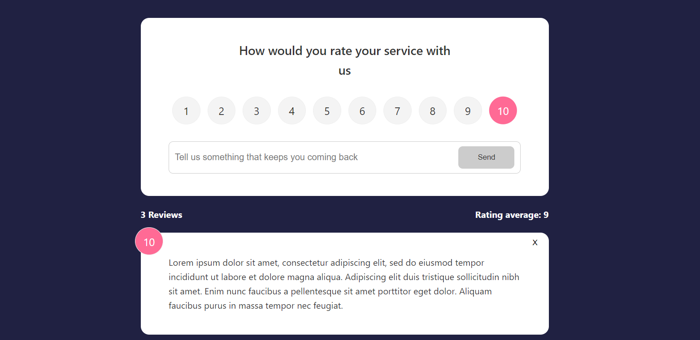

# Feedback App 📄✍️       



This Feedback app is the one of the my practices to enchance my knowledge in Svelte Framework. This Feedback App can receive feedback and rating from client and display it immediately after submit. However, it is only work in client side, which is not integration with any backend solution.


Thanks to the [Brad Traversy](https://github.com/bradtraversy) to guide this tutorial, which is I was followed along the [Svelte Crash Course](https://www.youtube.com/watch?v=3TVy6GdtNuQ) on his YouTube channel.


This Feedback app was built on top of Svelte + Vite.


To test this website locally, you need to have [Node.js](https://nodejs.org/en/) installed on your local machine. Then, kindly donwload the zip file of the source code. After extract the folder, open the terminal and type

```Shell
	npm install
	// This will install all the dependencies of the project
```


To run the Feedback App in development mode, type 

```Shell
	npm run dev
```

To build the original source code into JavaScript bundle, type

```Shell
	npm run build
```

To run the Feedback App in distribution/preview mode, type

```Shell
	npm run preview
```
